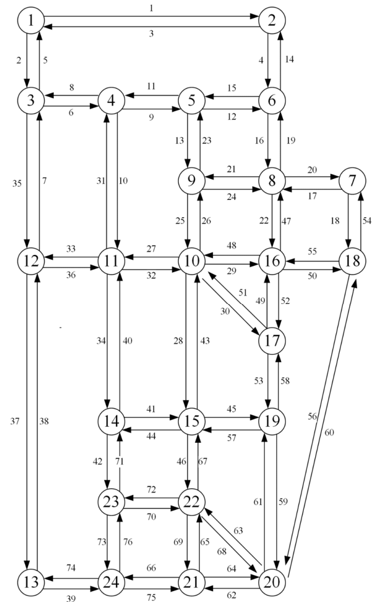
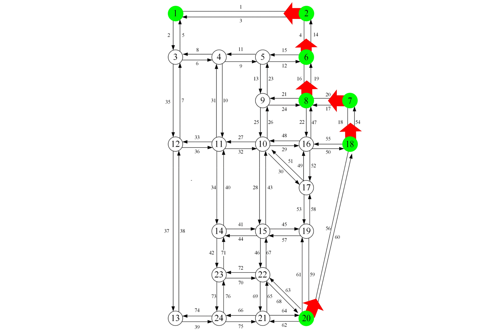

# 🚀 Dijkstra's Shortest Path Algorithm in Sioux Falls Network

This project demonstrates **Dijkstra's Algorithm** to compute the **shortest path** in the **Sioux Falls** road network.
The goal is to determine the **shortest route from node 1 to node 20**, based on given network weights.


## 📂 Files in This Repository:
- **`dijkstra.py`** → Python script implementing Dijkstra’s algorithm.
- **`Link Cost.xlsx`** → Excel file containing network weights (link travel times).
- **`sioux_falls_map.png`** → Real-world map of Sioux Falls.
- **`sioux_falls_network.png`** → Graph representation (Nodes & Links) of Sioux Falls network.
- **`shortest_path.png`** → Computed **shortest path** visualization.

---

## 📍 **Visualizations**
### 🗺️ Sioux Falls City Map


### 🔗 Sioux Falls Network (Nodes & Links)


### 🚀 Computed Shortest Path


---

## 🔧 **How to Run the Script**
To execute the **Dijkstra's Algorithm** on the **Sioux Falls transportation network**, follow these steps:

### **1️⃣ Install Python and Required Libraries**
Ensure Python is installed, then install the required dependencies:
```sh
pip install pandas networkx matplotlib
```
### **2️⃣ Run the Script**
```sh
python dijkstra.py
```
### **3️⃣ What Happens When You Run the Script**
- The script loads the Sioux Falls transportation network from **`Link Cost.xlsx`**
- It builds a graph representation where nodes are intersections and edges are roads.
- **Dijkstra's Algorithm** computes the **shortest path** between any two nodes based on travel times. By modifying the start and target nodes, you can determine the shortest path for any origin-destination pair within the network.
- The shortest path is printed in the terminal and visualized in a graph.
### **4️⃣ Example Output (Terminal)**
```sh
Best path from 1 to 20 (cost 22):
1 -> 2 -> 6 -> 8 -> 7 -> 18 -> 20

